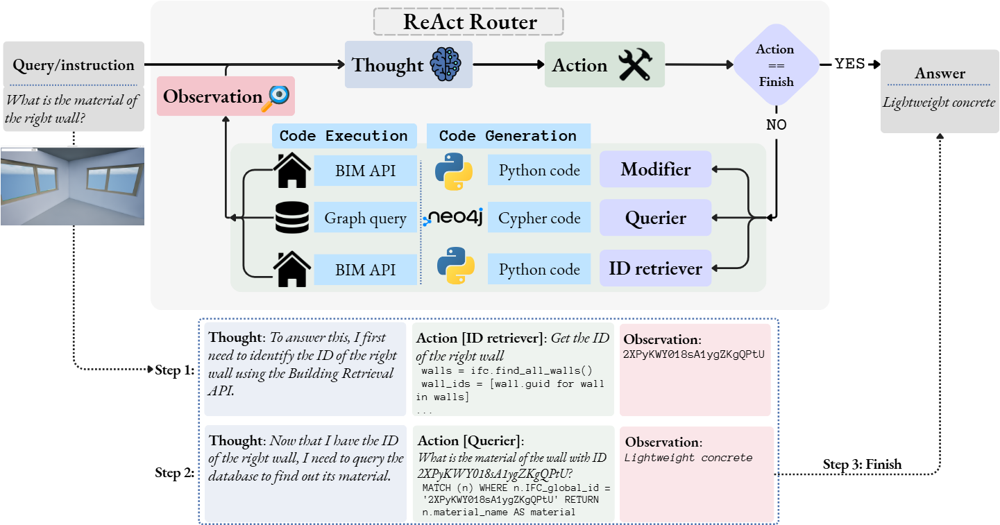
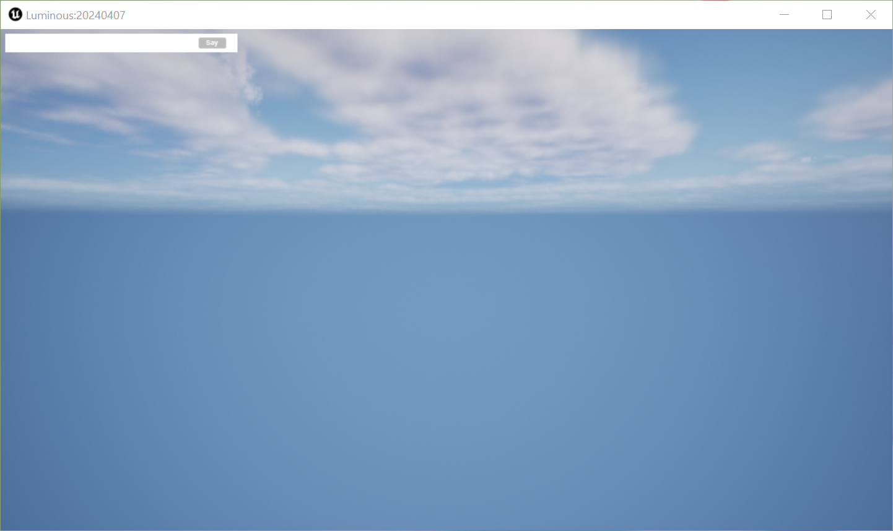
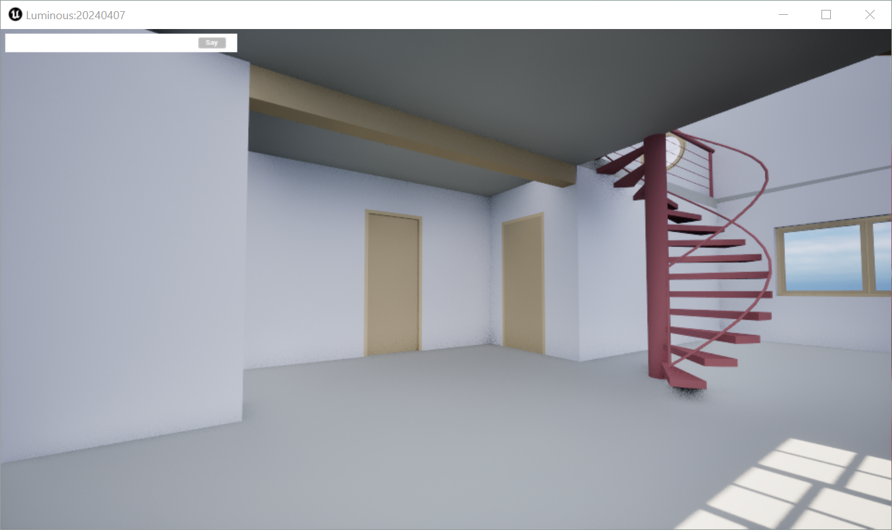
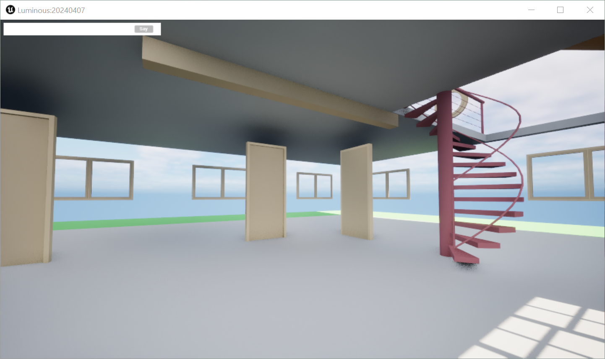

# VR-Arch: A Virtual Assistant for Architectural Design in VR

This repository contains the official implementation of **"A Virtual Assistant for Architectural Design in a VR Environment"**, accepted as a demo paper at EACL 2026.

**Authors:** Ander Salaberria, Oier Ijurco, Markel Ferro, Jiayuan Wang, Iñigo Vilá Muñoz, Roberto de Ioris, Jeremy Barnes, Oier Lopez de Lacalle 

---

## Overview

VR-Arch is an agentic system that enables natural language interaction with Building Information Modeling (BIM) data in a virtual reality environment. The system processes user commands iteratively, using specialized tools to modify 3D scenes, query metadata, and retrieve object information.

<p align="center">
    
</p>

### Key Features

- **Natural Language Interface**: Issue commands like "Hide all walls in sight" or "How many windows are in the building?"
- **Multi-Tool Agentic System**: Automatically selects appropriate tools based on query type
  - *Modifier Tool*: Generates Python code to manipulate the 3D environment
  - *Querier Tool*: Generates Cypher queries to access BIM metadata from Neo4j
  - *ID Retriever Tool*: Resolves object references from natural language descriptions
- **Real-time VR Interaction**: Changes are immediately reflected in the Unreal Engine sandbox

### System Components

This repository integrates several modules:

* **Sandbox**: Custom Unreal Engine environment for loading and rendering BIM files
* **Python API**: Interface for interaction with the sandbox
* **Neo4j Server**: Graph database for storing and querying BIM metadata using Cypher
* **VR-Arch Agent**: LLM-based orchestrator that routes queries and generates code

---

## Repository Structure
```
VR-Arch/
├── assets/                   # Images for documentation
├── config/                   # Configuration file examples per model and BIM environment 
├── data/
│   ├── eval/                 # Annotated instances for evaluation
│   ├── ifc/                  # IFC environment files
│   ├── props/                # Loadable props
│   └── schema/               # Graph schemas per environment
├── scripts/
│   ├── neo4j_install.sh      # Downloads and configures Neo4j
│   ├── neo4j_start.sh        # Starts Neo4j server
│   ├── neo4j_stop.sh         # Stops Neo4j server
│   └── vllm_start_router.slurm # Launches vLLM inference server
├── src/
│   ├── sandbox/              # [Downloaded separately] Unreal Engine executable
│   │   ├── Windows/          # Windows sandbox (Luminous.exe)
│   │   └── Linux/            # Linux sandbox (Luminous.sh)
│   ├── neo4j/                # [Auto-installed] Neo4j database server
│   │   ├── plugins/          
│   │   └── labs/             # APOC .jar file (move to plugins/)
│   ├── luminous/             # Python API for sandbox interaction
│   │   ├── luminous.py       # Main API connection class
│   │   ├── luminous_ifc.py   # IFC file handling
│   │   └── [IfcConvert]      # [Downloaded separately] IFC conversion tool
│   ├── prompting/            # LLM prompts and few-shot examples
│   └── ...
├── main.py                   # Main script to run VR-Arch
├── requirements.txt          # Python dependencies
├── README.md                 # This file
└── Paper.pdf                 # Demo paper in EACL 2026
```

---

## Installation & Setup

### Prerequisites

- **Python**: 3.11 or higher
- **Java**: Version 17 (required for Neo4j)
- **GPU**: NVIDIA GPU with sufficient VRAM (A100 80GB recommended for serving both LLMs; adjust based on model sizes)

### Quick Start Guide

Follow these steps carefully to avoid deployment issues:

#### 1. Clone Repository and Create Directories
```bash
git clone https://github.com/salanueva/vr-arch.git
```

#### 2. Install Python Dependencies
```bash
# Create virtual environment (recommended)
python -m venv venv
source venv/bin/activate  # On Windows: venv\Scripts\activate

# Install requirements
pip install -r requirements.txt
```

#### 3. Install ifcopenshell (Manual Installation Required)

**Important**: `pip install ifcopenshell` often fails. Follow these steps:

1. Visit: https://docs.ifcopenshell.org/ifcopenshell-python/installation.html
2. Navigate to the "ZIP packages" section
3. Download the appropriate package for your Python version and OS
4. Extract and install following the provided instructions

#### 4. Download and Setup Sandbox

Download the appropriate executable for your operating system:

- **Windows**: [Download Luminous.exe](https://drive.google.com/file/d/1JxPCLwUEc7SMMcnlmJBXcaxH3iVgGZtj/view?usp=sharing)
- **Linux**: [Download Luminous.sh](https://drive.google.com/file/d/1-MwG-NxYy9ccYPKLMqlLaKPm37kC9ujC/view?usp=sharing)

Extract to `src/sandbox/Windows/` or `src/sandbox/Linux/` respectively.

**Verify installation**:
- Windows: Run `src/sandbox/Windows/Luminous.exe`
- Linux: Run `sh src/sandbox/Linux/Luminous.sh`

You should see an empty 3D environment:

<p align="center">
    
</p>

#### 5. Install Java 17
```bash
# Ubuntu/Debian
sudo apt update
sudo apt install openjdk-17-jdk


# Windows: Download from https://www.oracle.com/java/technologies/downloads/#java17
```

**Set JAVA_HOME** (required for Neo4j):
```bash
# Linux - add to ~/.bashrc or ~/.zshrc
export JAVA_HOME=/usr/lib/jvm/java-17-openjdk-amd64  # Adjust path for your system

# Windows - add to System Environment Variables
# JAVA_HOME = C:\Program Files\Java\jdk-17
```

#### 6. Install and Configure Neo4j

Update the Java path in the installation script:
```bash
nano scripts/neo4j_install.sh
# Set JAVA_HOME to your Java 17 installation path (from step 5)
```

Run the installation script:
```bash
bash scripts/neo4j_install.sh
```

Install APOC plugin:
```bash
mv src/neo4j/labs/*.jar src/neo4j/plugins/
```

**Verify installation**:
```bash
bash scripts/neo4j_start.sh
```

Access Neo4j browser at http://localhost:7474 (default credentials: neo4j/neo4j, you'll be prompted to change password)

Stop Neo4j when done:
```bash
bash scripts/neo4j_stop.sh
```

#### 7. Download IFC Converter

Download the appropriate IFC conversion tool:

- **Windows**: [IfcConvert.exe](https://drive.google.com/file/d/1uC-7S6LgioBF-WLwtBklamXlc0_FAW0e/view?usp=sharing)
- **Linux**: [IfcConvert.elf64](https://drive.google.com/file/d/1n_rtzLPNKvLXFccLlKLprTNPdvVDLQ3p/view?usp=sharing)

Place the downloaded file in `src/luminous/`

**Linux only** - Make executable:
```bash
chmod +x src/luminous/IfcConvert.elf64
```

#### 8. Setup vLLM Inference Server

**GPU Requirements**: The default configuration requires ~80GB VRAM to serve both an 8B and 9B model simultaneously.

```bash
# Edit script to match your hardware configuration
nano scripts/vllm_start_router.slurm
# Modify GPU allocation, model names, and resource limits

# Submit job
sbatch scripts/vllm_start_router.slurm
```

#### 9. Configure the System

The configuration is specified in config.yaml, where you can specify different input parameters. You can find examples in They are divided into six groups:

 * *sandbox*: you can specify the IFC file to be loaded in the sandbox and the IP address and port in which the sandbox is listening (127.0.0.1:9999 by default).
 * *helperLLM*: when using a vLLM server, you will need to specify the model name and the API's URL and key to connect to the LLM that acts as the router and Python code generator.
 * *cypherLLM*: when using a vLLM server, you will need to specify the model name and the API's URL and key to connect to the LLM that generates Cypher code.
 * *neo4j*: when using the neo4j server, you will need to define the API's URL, username, password and the database name, which can be set here. You can also specify whether you want to reset the Neo4j graph when running the main script or not.
 * *agent*: specifies the maximum number of turns that the router will take before finishing, as well as activating the verbose mode of the main script.
 * *voiceLayer*: you can specify the api URL and key, along an input argument that controls whether partial audios are transcribed or not. 

Create your configuration file:
```bash
cp config.example.yaml config.yaml
nano config.yaml  # Edit with your settings
```

#### 10. Run VR-Arch

You need three services running simultaneously. Open separate terminals:

**Terminal 1 - Start Sandbox**:
```bash
# Windows
src/sandbox/Windows/Luminous.exe

# Linux
sh src/sandbox/Linux/Luminous.sh
```

**Terminal 2 - Start Neo4j** (in the server):
```bash
sh scripts/neo4j_start.sh
```

**Terminal 3 - Start vLLM** (in the server):
```bash
sbatch scripts/vllm_start_router.slurm
```

**Terminal 4 - Run VR-Arch Agent**:
```bash
source venv/bin/activate  # Activate virtual environment
python main.py --config config.yaml
```

You will be prompted to enter commands. Try:
```
> Hide all walls in sight
```

The system will process your command and modify the 3D scene:

<p align="center">
    
    
</p>

---

## Evaluation Dataset

The evaluation dataset is located in `data/eval/` and consists of task-oriented queries for BIM manipulation in VR. Each sample includes a natural language command paired with ground truth Python code.

### Dataset Structure

Each CSV file contains the following fields:
- **ID**: Unique task identifier
- **Difficulty**: Easy or Hard
- **Building**: IFC model used (e.g., "House")
- **Position/Rotation**: Camera viewpoint coordinates
- **Prior State**: Previous modifications applied (if any)
- **Type**: Task category (Visibility, Removal, Coloring, Transformation, Camera, Addition, or combinations)
- **Query**: Natural language instruction
- **Code**: Ground truth Python code following the Luminous API

### Task Categories

- **Visibility** (e.g., "Hide the left door")
- **Removal** (e.g., "Delete the slab")
- **Coloring** (e.g., "Make the leftmost wall purple")
- **Transformation** (e.g., "Put all doors in sight 3 meters in front of me")
- **Camera** (e.g., "Look at the rightmost door")
- **Addition** (e.g., "Insert a lamp in the wall between the two windows")

Tasks may combine multiple categories (e.g., "Look at the back and hide the wall found there" = Camera + Visibility).

## Python API 

The Sandbox script is prepared to generate Python code that follows a custom API. You won't need to write the code itself, but it is good to have a general gist. You can find it inside `src/luminous`.

The connection with the sandbox is done with the following code. 

```
from src.luminous.luminous import Luminous

l = Luminous()
```

In order to load a building into the scene, and IFC object is loaded:

```
from src.luminous.luminous_ifc import IFC

ifc = IFC(l.load_ifc(ifc_filename))
```

When the LLM generates the code, it takes these variables into account, as if `l` and `ifc` were already instantiated. You can play with the functions found in the API freely. You can check `src/prompting/sandbox_prompts.py` for the documentation (`API_DOCS`) and a few examples (`API_EXAMPLES`).